# evobase-plugin_副本 架构图与调用关系增强版

## 1. 文档目的

这份文档是对 `evobase-plugin_副本-项目总结与复现指南.md` 的增强补充版，重点不再重复“模块说明”，而是把项目的：

- 分层架构
- 运行链路
- 命令调用关系
- 子代理协作方式
- 脚本支撑关系
- 复现时的模块拼装方式

用 **结构图 + 时序图 + 调用图** 的方式表达出来，方便你在其他项目中快速照着搭建。

---

## 2. 总体架构图

从系统全貌看，这个项目是一个典型的 **Agent Workflow 文档系统**。

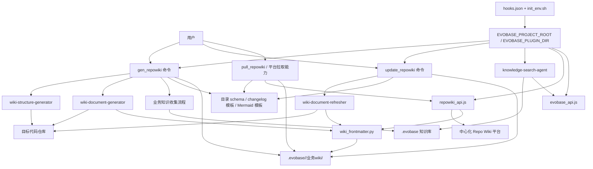

### 这张图表达的重点

1. **命令层是入口**
   - 用户通常不会直接调用脚本，而是通过命令进入系统。
2. **Agent 是核心执行层**
   - 真正做目录规划、文档生成、文档保鲜的是子代理。
3. **脚本层是基础设施**
   - `repowiki_api.js`、`evobase_api.js`、`wiki_frontmatter.py` 都是底层支撑，不负责业务决策。
4. **模板层是约束层**
   - schema、changelog 模板、业务知识收集规范决定输出长什么样。
5. **知识库与业务wiki是数据落点**
   - 最终文档、业务知识、中间产物都会进入 `.evobase` 体系。

---

## 3. 分层职责图

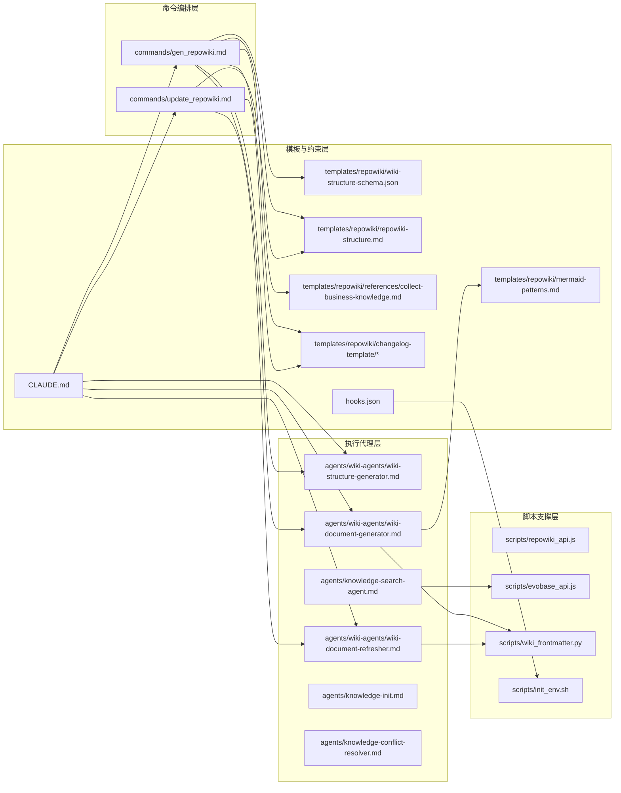

### 分层复现建议

如果你要在其他项目复现，不建议直接照搬所有文件，而应按层次迁移：

- **先迁移命令编排层**：让流程跑起来
- **再迁移执行代理层**：把目录规划、正文生成、保鲜拆开
- **再迁移脚本层**：处理 API 和 frontmatter
- **最后迁移模板与约束层**：稳定输出风格与结构

---

## 4. 生成 Wiki 的完整调用时序图

入口文件：`evobase-plugin_副本/commands/gen_repowiki.md`

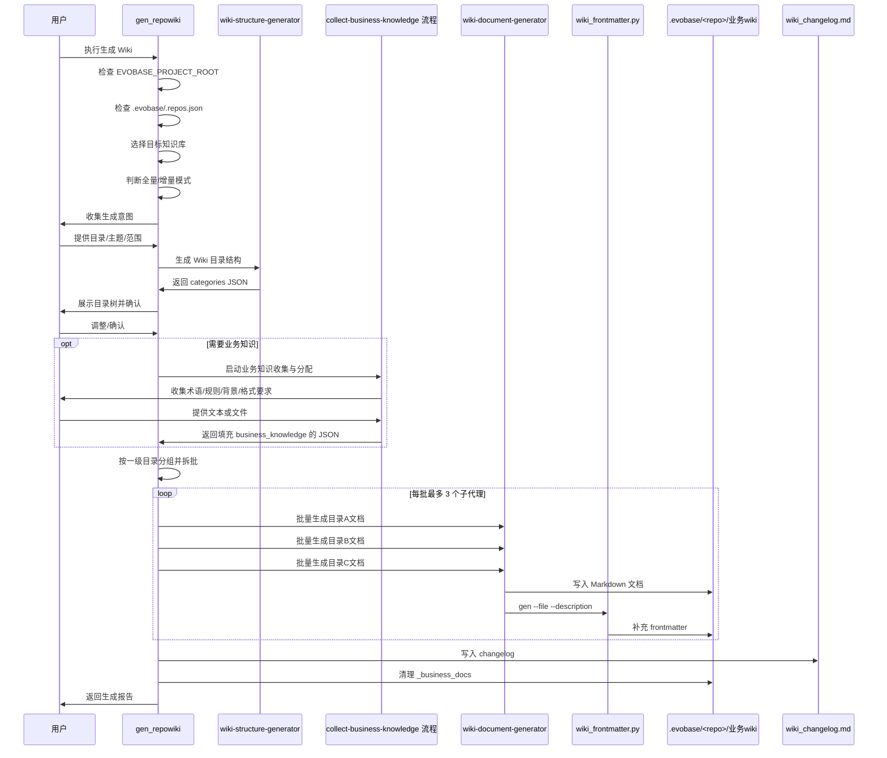

### 这条链路中最关键的 4 个阶段

#### 阶段 1：预检查
负责确定：
- 运行环境是否可用
- 知识库是否存在
- 当前是哪个 repo
- 输出位置在哪里

#### 阶段 2：结构规划
这里调用 `wiki-structure-generator`，只解决“应该写哪些文档、如何分组”，不直接写正文。

#### 阶段 3：业务知识注入
如果用户提供业务规则、术语或格式要求，会在这个阶段被分发给文档节点。

#### 阶段 4：并发生成
由 `wiki-document-generator` 负责真正写文件，并调用 `wiki_frontmatter.py` 生成元数据。

---

## 5. 保鲜 Wiki 的完整调用时序图

入口文件：`evobase-plugin_副本/commands/update_repowiki.md`

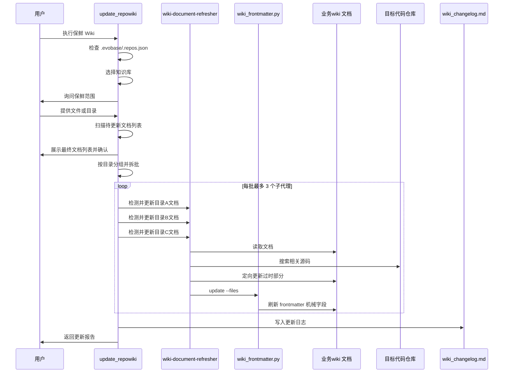

### 这个流程与生成流程的本质区别

| 维度 | 生成流程 | 保鲜流程 |
|------|----------|----------|
| 目标 | 创建新文档 | 更新已有文档 |
| 入口数据 | 用户意图 + 代码仓库 | 已有 Wiki + 当前代码仓库 |
| 写文件方式 | 新建/写入 | 定向编辑 |
| frontmatter 操作 | `gen` | `update` |
| 风险控制 | 防止生成结构混乱 | 防止误重写未变内容 |

也就是说，保鲜不是“再生成一次”，而是完全不同的工作模型。

---

## 6. 远端拉取 Wiki 的调用关系图

核心文件：`evobase-plugin_副本/scripts/repowiki_api.js`

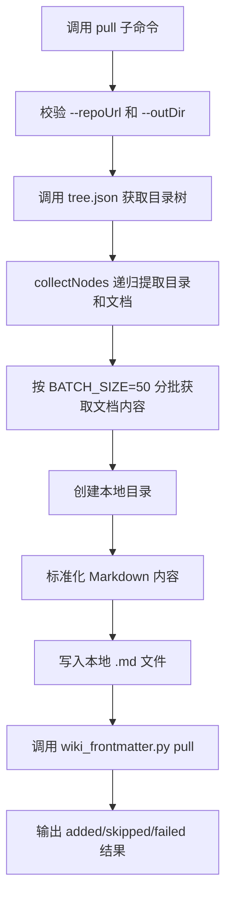

### `repowiki_api.js` 内部模块关系

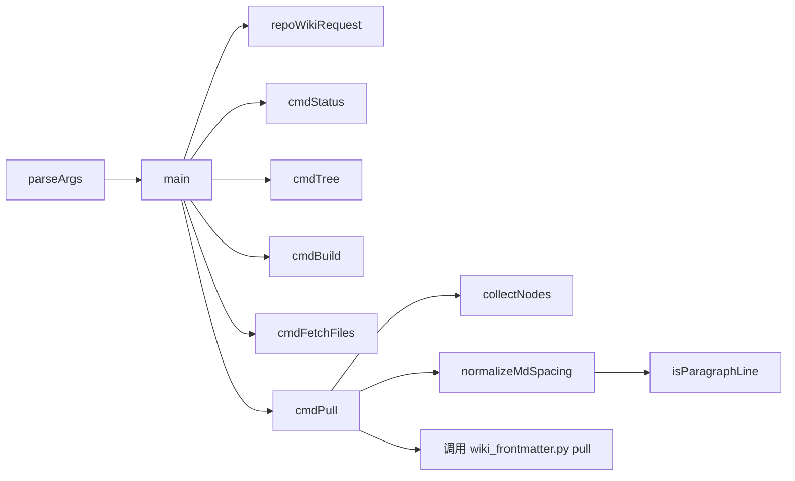

### 为什么这部分值得单独复现

如果你的其他项目里也存在“远端知识平台 + 本地仓库”的双存储模式，那么这段能力几乎可以原样复用：

- 先取树
- 再取内容
- 再做标准化
- 再补 frontmatter
- 最后输出结构化结果

---

## 7. 知识检索链路图

核心文件：
- `evobase-plugin_副本/agents/knowledge-search-agent.md`
- `evobase-plugin_副本/scripts/evobase_api.js`

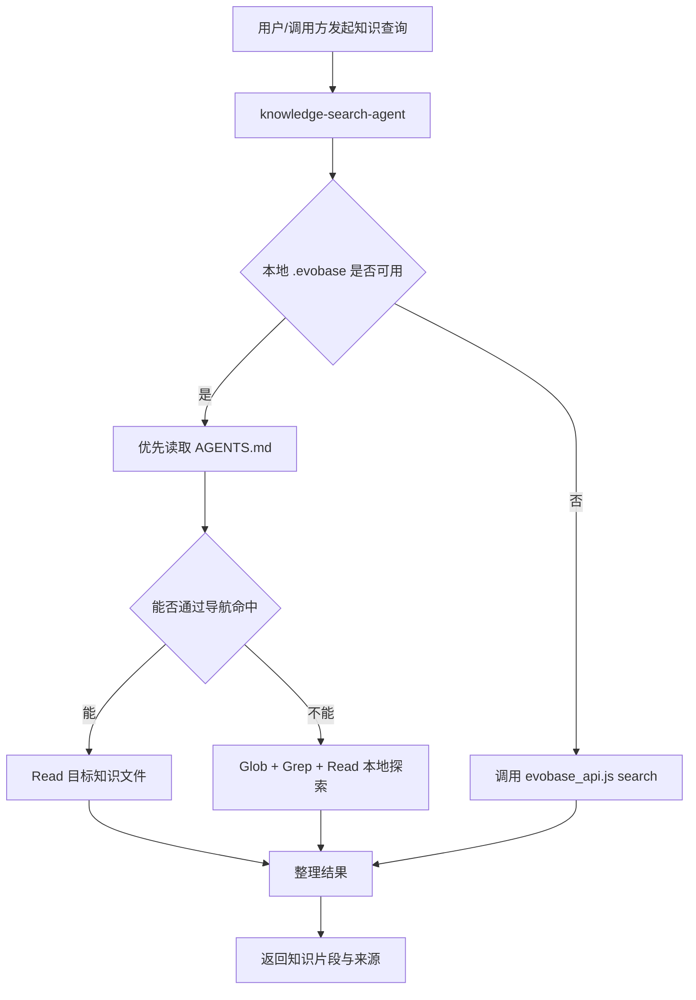

### `evobase_api.js` 内部命令结构

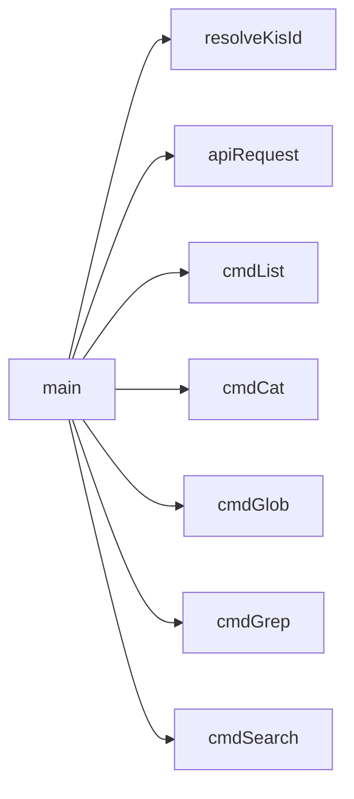

### 这个链路的关键设计

1. **本地优先**：先用本地知识库，避免无谓远端调用。
2. **结构化导航优先**：优先利用 `AGENTS.md`，比全文搜索更稳。
3. **语义检索兜底**：本地没有时再做向量检索。
4. **知识优先级明确**：应用知识 > 公共知识。

---

## 8. Front Matter 生命周期图

核心文件：`evobase-plugin_副本/scripts/wiki_frontmatter.py`

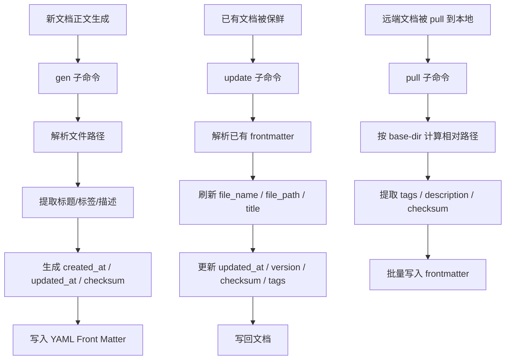

### 为什么要单独画这张图

因为 `wiki_frontmatter.py` 不是一个附属小脚本，而是整个系统的“文档治理中心”。

没有它，生成出来的文档只是普通 Markdown；
有了它，文档就变成了：
- 可追踪
- 可审计
- 可版本化
- 可检索
- 可校验

---

## 9. 环境初始化关系图

核心文件：
- `evobase-plugin_副本/hooks.json`
- `evobase-plugin_副本/scripts/init_env.sh`

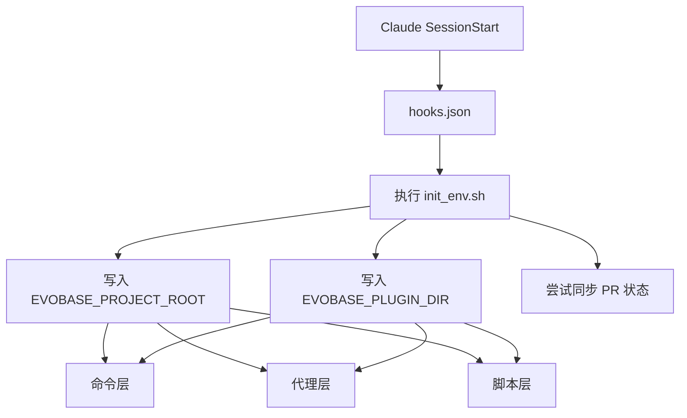

### 这部分在复现时为什么不能省

因为项目里大量 prompt 和脚本都默认依赖：
- `EVOBASE_PROJECT_ROOT`
- `EVOBASE_PLUGIN_DIR`

如果没有统一初始化机制，你在其他项目复现时会出现：
- 模板路径难定位
- 脚本路径难定位
- 当前 repo 根目录难统一
- 命令与代理对上下文理解不一致

---

## 10. 模块依赖总表

| 模块 | 主要功能 | 直接依赖 | 输出/影响 |
|------|----------|----------|-----------|
| `commands/gen_repowiki.md` | 编排生成流程 | `wiki-structure-generator`、`wiki-document-generator`、结构模板、业务知识模板 | 新 Wiki、changelog |
| `commands/update_repowiki.md` | 编排保鲜流程 | `wiki-document-refresher`、changelog 模板 | 更新后的 Wiki、changelog |
| `agents/wiki-agents/wiki-structure-generator.md` | 生成目录结构 | `wiki-structure-schema.json`、代码仓库 | categories JSON |
| `agents/wiki-agents/wiki-document-generator.md` | 生成正文 | 代码仓库、`wiki_frontmatter.py`、Mermaid 模板 | Markdown 文档 |
| `agents/wiki-agents/wiki-document-refresher.md` | 保鲜正文 | 现有 Wiki、代码仓库、`wiki_frontmatter.py` | 更新后的文档 |
| `agents/knowledge-search-agent.md` | 检索知识库 | 本地 `.evobase`、`evobase_api.js` | 知识片段 |
| `agents/knowledge-init.md` | 初始化知识库 | 模板目录 | 知识库基础目录 |
| `agents/knowledge-conflict-resolver.md` | 解决知识冲突 | Git 冲突文件 | 合并后的知识文档 |
| `scripts/repowiki_api.js` | 平台 Wiki API 封装 | 远端 Repo Wiki API、`wiki_frontmatter.py` | 本地拉取文档 |
| `scripts/evobase_api.js` | 知识库 API 封装 | 远端 Evobase API | 搜索与读取结果 |
| `scripts/wiki_frontmatter.py` | 文档元数据治理 | 文档文件本身 | frontmatter、版本、校验和 |
| `scripts/init_env.sh` | 初始化环境变量 | Claude hook 环境 | 统一上下文 |
| `hooks.json` | 启动 hook 配置 | `init_env.sh` | 注入环境变量 |
| `CLAUDE.md` | AI 工作说明 | 无 | 提示词稳定性与一致性 |

---

## 11. 复现时的拼装架构图

如果你要在别的项目中复现，建议分四层拼装，而不是一次性全迁移。

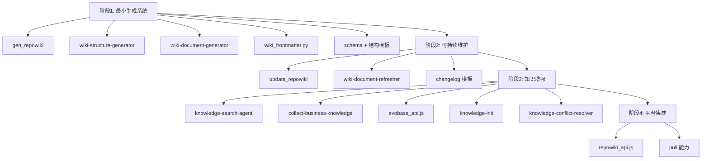

### 复现顺序建议

#### 阶段 1：先做“能生成”
只要你能完成：
- 目录规划
- 正文生成
- frontmatter 补充

系统就已经可用了。

#### 阶段 2：再做“能维护”
补上：
- 保鲜代理
- changelog

系统就变成持续可运营，而不是一次性工具。

#### 阶段 3：再做“更懂业务”
补上：
- 知识检索
- 业务知识注入

文档质量会明显提升。

#### 阶段 4：最后做“平台互通”
补上：
- Repo Wiki 平台 API 对接
- pull 能力

这样才能兼容“中心化平台 + 本地仓库”双模式。

---

## 12. 最终落地建议

### 如果你的目标是“在其他项目快速复制一套可用版”
优先复制：
- `commands/gen_repowiki.md`
- `agents/wiki-agents/wiki-structure-generator.md`
- `agents/wiki-agents/wiki-document-generator.md`
- `scripts/wiki_frontmatter.py`
- `templates/repowiki/wiki-structure-schema.json`
- `templates/repowiki/repowiki-structure.md`
- `hooks.json`
- `scripts/init_env.sh`

### 如果你的目标是“做一套团队长期使用的系统”
再追加：
- `commands/update_repowiki.md`
- `agents/wiki-agents/wiki-document-refresher.md`
- `templates/repowiki/changelog-template/*`
- `agents/knowledge-search-agent.md`
- `templates/repowiki/references/collect-business-knowledge.md`

### 如果你的目标是“接企业内部平台”
最后追加：
- `scripts/evobase_api.js`
- `scripts/repowiki_api.js`
- `agents/knowledge-init.md`
- `agents/knowledge-conflict-resolver.md`

---

## 13. 一句话总结

这套项目最值得复现的，不是某个单一脚本，而是它非常清晰的架构分工：

- **命令层** 管流程
- **代理层** 管执行
- **脚本层** 管基础设施
- **模板层** 管约束与输出一致性
- **知识库层** 管业务上下文
- **frontmatter + changelog** 管文档治理

如果上一份总结文档解决的是“这项目都有什么、怎么实现”，那么这一份增强版解决的是：

**这些模块在运行时是如何协作起来的，以及你在别的项目里应该按什么顺序把它们拼起来。**

